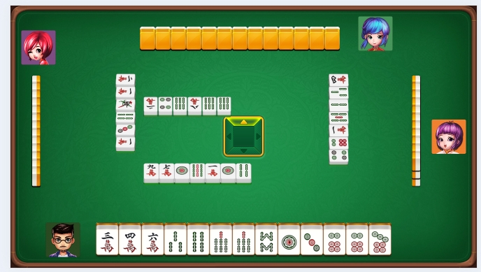

# <p align="center">使用Laya引擎开发的联网麻将游戏</p>

## 🔥 [服务端仓库地址](https://github.com/liumengniu/majiang-server)

[//]: # (https://github.com/ikatyang/emoji-cheat-sheet 表情仓库)


## 🎞️ 项目介绍

> 使用laya3.x游戏引擎开发的联网棋牌游戏。 \
> 以下是通过项目生成的原始示例，未经任何修改：
> 


## 🎨 项目结构

```
├── majiang                # 麻将
├── assets                 # 静态资源目录
├── bin                    # 测试运行的index.html首页的入口，以及IDE内置的代码入口（如html/bundle.js） - 开发不要动
├── engine                 # 引擎库的声名文件 - 开发不要动
├── library                # 开发不要动
├── settings               # 游戏配置项 - 开发不要动
├── src                    # 项目源码目录
│   ├── prefab/               # 预制体相关ts代码的集合
│   ├── main.ts               # 入口启动场景的脚本（也可以换别的，这个自己设置）     
│   ├── utils/                # 公共工具类
├── .gitignore             # git忽略配置
├── package.json           # 依赖表
└── tsconfig.json          # ts配置文件
```


## 🌟 Star History
<br>


[](https://github.com/liumengniu/majiang&Timeline)